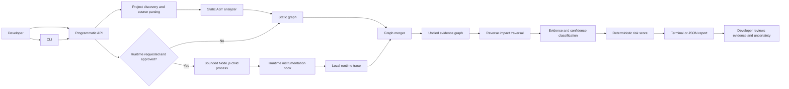
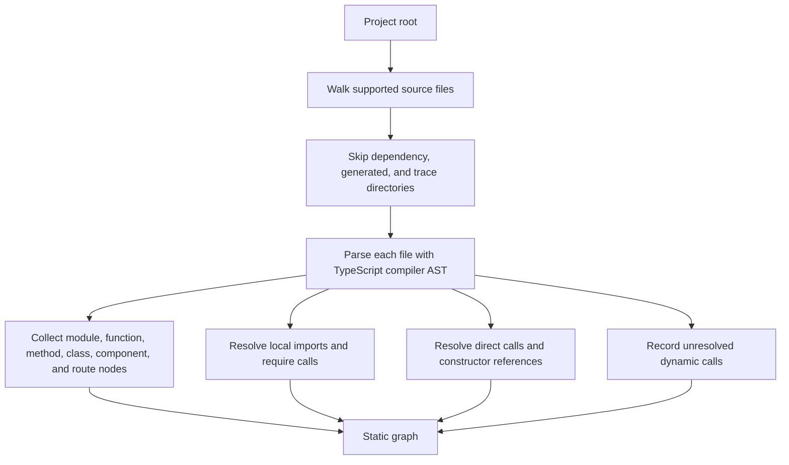
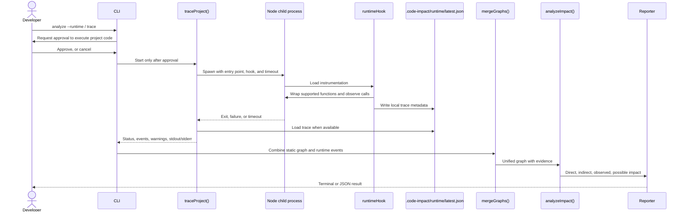

# Code Impact Analyzer: Architecture and Developer Mental Map

This document describes the current Version 1 implementation. It is intended to help a developer find the right layer to change, understand why each layer exists, and follow data from a CLI command to an impact report.

## 1. Product mental model

The analyzer answers:

> If this code changes, which parts of the project depend on it, and what evidence supports that result?

It builds an evidence-bearing graph from two independent inputs:

- **Static analysis** parses source code and records relationships visible in its syntax.
- **Runtime tracing** optionally executes an approved Node.js entry point in a child process and records function calls observed in that execution.

The graph merger preserves the distinction between those evidence sources. The impact engine starts at the changed node and follows incoming dependency relationships to find callers and dependents. Confidence and risk are deterministic summaries of the collected evidence; neither claims to predict every possible execution.

## 2. High-level architecture



The programmatic API can be called directly, without the CLI. Consent is enforced by the CLI before it launches a runtime trace; code using the library directly is responsible for obtaining any consent it needs before calling `traceProject()`.

## 3. Data-flow diagrams

### 3.1 Static analysis flow



The project walk is deterministic: supported files are sorted before analysis, and symbol IDs use normalized project-relative paths. The analyzer does not load or execute the project's code for a static-only analysis.

### 3.2 Runtime and combined impact flow



Static-only operation skips the consent prompt, child process, runtime hook, and trace file. Runtime tracing is optional and bounded by a timeout. A timeout or application failure is returned as a non-success status, rather than represented as a successful trace.

### 3.3 Graph direction and impact traversal

Edges point from the code that depends on something to the thing it depends on:

```text
checkout()  --calls-->  createOrder()  --calls-->  validateToken()
```

Therefore, to estimate what is affected by a change to `validateToken()`, the impact engine follows edges **backward**:

```text
validateToken()  <-- createOrder()  <-- checkout()
                    direct caller      indirect caller
```

This direction is the core graph invariant. Adding or changing an edge must preserve it, or reverse impact results will be incorrect.

## 4. Repository map

| Location | Responsibility | Why it exists |
| --- | --- | --- |
| [`bin/code-impact.js`](./bin/code-impact.js) | CLI parsing, consent prompt, user-facing output | Keeps terminal UX and command-line concerns out of the reusable engine |
| [`src/index.js`](./src/index.js) | Public library API, runtime process management, and graph merge | Gives CLI and library consumers one stable entry point |
| [`src/staticAnalyzer.js`](./src/staticAnalyzer.js) | Source discovery, AST parsing, symbol and static edge construction | Isolates syntax-based analysis from execution and reporting |
| [`src/runtimeHook.js`](./src/runtimeHook.js) | Function instrumentation and trace writing inside the child process | Keeps runtime observations separate from the main analyzer process |
| [`src/graph.js`](./src/graph.js) | `CodeNode` and `CodeEdge` data structures | Gives nodes and edges a consistent, serializable shape |
| [`src/impact.js`](./src/impact.js) | Target resolution and reverse graph traversal | Implements the primary “who depends on this?” question |
| [`src/confidence.js`](./src/confidence.js) | Confidence values derived from evidence | Avoids scoring evidence differently in unrelated layers |
| [`src/risk.js`](./src/risk.js) | Transparent risk calculation and breakdown | Keeps prioritization logic deterministic and inspectable |
| [`test/analyzer.test.js`](./test/analyzer.test.js) | End-to-end behavior, CLI and primary fixture tests | Protects complete user-visible flows |
| [`test/robustness.test.js`](./test/robustness.test.js) | Portability, parser, API, and runtime edge cases | Catches regressions across project layouts and execution patterns |
| [`.github/workflows/test.yml`](./.github/workflows/test.yml) | OS and Node-version test matrix | Checks behavior on Windows, macOS, and Linux in CI |

## 5. Senior-developer function map

### CLI: `bin/code-impact.js`

| Function | Responsibility | Reason for separation |
| --- | --- | --- |
| `usage()` | Displays supported commands and options | One place to maintain CLI help |
| `parseArguments(args)` | Converts flags and positionals into options | Keeps parsing rules testable and separate from analysis |
| `chooseProjectAndTarget(positional)` | Interprets a directory or file argument | Makes the command's project-root/target convention explicit |
| `confirmRuntime(projectRoot, entry, acceptedByFlag)` | Requests approval before CLI-launched code execution | Runtime tracing executes the selected project; approval must be visible |
| `findTargets(graph, fileArgument, functionName, projectRoot)` | Selects graph nodes for a CLI target | Keeps CLI argument semantics out of generic graph traversal |
| `renderImpact(report)` | Formats impact data for a terminal | Separates human output from the JSON/library result |
| `main()` | Orchestrates command flow and exit status | Defines the high-level CLI use case without owning parsing or analysis internals |

### Public API and orchestration: `src/index.js`

| Function | Responsibility | Reason for separation |
| --- | --- | --- |
| `analyzeProject(projectRoot)` | Runs static analysis and adds summary metadata | Standard project-level library entry point |
| `analyzeFile(projectRoot, filePath)` | Selects a file's nodes and computes their combined impact | Lets callers ask about a file without recreating target selection |
| `analyzeFunction(projectRoot, functionName, filePath)` | Finds a named function/component and computes impact | Offers a function-level API, optionally narrowed by file |
| `loadRuntimeTrace(tracePath)` | Reads and minimally validates a local trace file | Gives stored traces a single loading/validation path |
| `traceProject(projectRoot, entryScript, options)` | Validates inputs, starts a bounded child process, returns its status and trace | Contains process-boundary logic outside the runtime hook and CLI |
| `mergeGraphs(staticGraph, runtimeTrace)` | Combines nodes and edges while retaining evidence | Keeps evidence merging reusable and independent of report formatting |
| `buildStaticGraph(projectRoot)` | Convenience API returning the static graph | Lets library consumers request only graph data |

### Static analysis: `src/staticAnalyzer.js`

`analyzeProject(projectRoot)` is the main entry point. Its internal helpers each protect a small rule:

- `collectFiles()` discovers supported files and applies directory exclusions.
- `scriptKind()` tells the parser whether a file is JS, JSX, TS, or TSX.
- `nodeName()` and `isFunctionNode()` give AST nodes consistent symbol identity.
- `isExported()` and `isDefaultExported()` record export information for cross-file lookup.
- `resolveLocalModule()` resolves relative module paths, including supported extension substitutions.
- `containsJsx()` identifies JSX-bearing functions that can be React components.
- `resolveCallTarget()` maps local or imported call names to known symbol IDs.
- The per-file `collect()` traversal creates symbol nodes and framework route nodes.
- The import traversal records file dependencies and local bindings.
- The call traversal creates direct-call, constructor, callback-possible, and route-handler edges; unresolved dynamic calls are retained separately.

The separation between discovery, symbol collection, import binding, and call resolution matters because a call can appear in a file before the target module or symbol has been visited. The analyzer gathers project-wide symbol information before using imports to resolve calls.

### Runtime instrumentation: `src/runtimeHook.js`

- `functionName()` derives a stable-ish display name from a function AST node.
- `instrumentSource()` parses and transforms supported source files, then transpiles TypeScript where needed.
- `globalThis.__codeImpactRun()` records the active caller/callee relationship and uses `AsyncLocalStorage` to keep the call context across asynchronous work.
- `writeTrace()` writes metadata locally at process exit and on the timeout signal.
- Module compile and load hooks apply the transformation without editing project source files.

The hook runs in the child process so its global state and module-loader changes do not leak into the analyzer process. The event cap bounds trace growth. Unsupported source formats or loader behavior should remain warnings or limitations; they must not be presented as observed calls.

### Graph, impact, confidence, and risk

- `CodeNode` and `CodeEdge` in `src/graph.js` define serializable graph records.
- `analyzeImpact(graph, target)` in `src/impact.js` resolves target IDs, builds an index from callee to incoming dependents, then traverses backward. It classifies direct, indirect, runtime-observed, and possible paths.
- `confidenceForEvidence(evidence)` in `src/confidence.js` maps evidence labels to confidence labels. Evidence should be attached before confidence is selected.
- `computeRisk(impact, graph, targetIds)` in `src/risk.js` calculates a bounded, explainable score. It is a prioritization heuristic, not a probability.

Keeping these concerns separate means a new output format or framework detector should not need to change reverse traversal or the risk formula.

## 6. Key data shapes and invariants

### Code node

A node represents a module, function, method, class, component, route, or runtime-only symbol. Its `id` is used for graph linkage; display names alone are not unique.

```text
id:   project-relative-file::symbol
name: display name
type: module | function | method | class | component | route | runtime-symbol
file: normalized project-relative path
```

### Code edge

```text
source: dependent/caller node ID
target: dependency/callee node ID
relationship: calls | depends-on | registers | contains | instantiates | may-call
evidence: static | runtime | static+runtime | possible
confidence: low | medium | high | very-high
```

Rules to preserve when extending the graph:

1. Keep IDs project-relative and normalize separators to `/` so reports are portable across operating systems.
2. Keep the edge direction caller/dependent → callee/dependency; impact traversal reverses it.
3. Do not convert unresolved dynamic expressions into definite graph edges.
4. Preserve provenance when static and runtime evidence are merged.
5. Treat runtime evidence as “observed in this run,” not proof of universal behavior.
6. Keep trace payloads limited to execution metadata, not function arguments or return values.
7. If runtime execution is requested from a CLI, obtain consent first and ensure the child process is bounded and its outcome is reported.

## 7. Adding a feature: where to start

### Add a syntax or framework detector

1. Add a focused fixture under `test/fixtures/`.
2. Extend the AST traversals and node/edge creation in `src/staticAnalyzer.js`.
3. Add assertions for the resulting node type, edge direction, evidence, and confidence.
4. Verify the fixture's unresolved cases remain uncertain rather than guessed.

### Add a runtime instrumentation case

1. Add a minimal entry point in a temporary-project test or under the runtime fixtures.
2. Check the minimum supported Node version and loader behavior.
3. Assert the event metadata and application output, as well as the child's exit status.
4. For long-running fixtures, use a short timeout and verify the analyzer returns `timed_out`.
5. Never start an unbounded application in a test.

### Change impact classification or risk

1. Update `src/impact.js` for traversal or classifications.
2. Update `src/confidence.js` only when an evidence type's confidence meaning changes.
3. Update `src/risk.js` for score weights or levels.
4. Add unit-style assertions for boundary cases and keep the breakdown visible in reports.
5. Update the corresponding model documentation in [`README.md`](./README.md) and this architecture document.

### Change a public API or CLI

1. Preserve the reusable engine boundary in `src/index.js`.
2. Keep consent and terminal presentation in `bin/code-impact.js`.
3. Add CLI tests using `spawnSync` and assert stdout, stderr, and exit status.
4. Keep JSON output machine-readable and test it by parsing it, not only matching text.

## 8. Testing and portability

Run the maintained test command from the repository root:

```bash
npm ci
npm test
```

The test suite uses Node's built-in test runner. `test/robustness.test.js` creates temporary projects for paths with spaces and removes them with test cleanup hooks, so tests do not depend on a developer-specific directory. Runtime ESM tests are skipped on Node versions that do not support the required synchronous module hooks; CommonJS and static tests remain relevant on supported older Node versions.

GitHub Actions runs the same command on Windows, macOS, and Linux with Node.js 18, 20, 22, and 24. A local pass is useful evidence, but CI is the check that exercises the other operating systems.

## 9. Current boundaries

- Static module resolution focuses on relative local paths; project-specific aliases and package export maps are not fully resolved.
- Framework detection is intentionally narrow and syntax-based. It does not build a complete framework or TypeScript type graph.
- Dynamic dispatch, reflection, dependency injection, and runtime-generated functions can remain unknown.
- Runtime tracing is for Node.js execution, not a browser or full frontend build environment.
- The library API caller is responsible for approval before invoking `traceProject()`; the CLI provides the interactive/non-interactive consent gate.
- The combined graph estimates impact; it is not a proof that a change will or will not break behavior.

These boundaries are part of the product contract. Improvements should make uncertainty more precise without silently turning uncertain relationships into facts.
